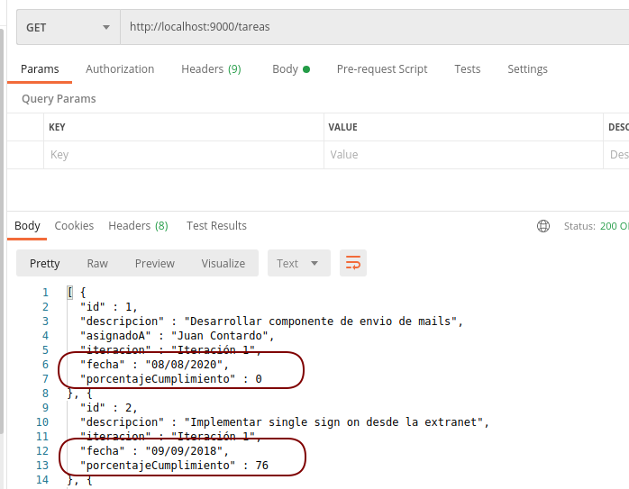

# Spring Boot - Tareas pendientes de un equipo de Desarrollo

[](https://github.com/uqbar-project/eg-tareas-springboot/actions/workflows/build.yml) 


## Otros mecanismos de serialización

### Custom serializer

En esta variante vemos cómo definir un serializador _custom_ para las tareas. Generamos un TareaSerializer que hereda del serializador estándar que nos provee Spring:

```xtend
class TareaSerializer extends StdSerializer<Tarea> {
	
	new() {
		super(Tarea)
	}
	
	override serialize(Tarea tarea, JsonGenerator gen, SerializerProvider provider) throws IOException {
		gen => [
			writeStartObject
			if (tarea.id !== null) {
				writeNumberField("id", tarea.id)
			}
			writeStringField("descripcion", tarea.descripcion)
			if (tarea.asignatario !== null) {
				writeStringField("asignadoA", tarea.asignatario.nombre)
			}
			writeStringField("iteracion", tarea.iteracion)
			writeStringField("fecha", DateTimeFormatter.ofPattern("dd/MM/yyyy").format(tarea.fecha))
			writeNumberField("porcentajeCumplimiento", tarea.porcentajeCumplimiento)
			writeEndObject
		]
	}
	
}
```

- En la clase Tarea, le asociamos nuestro serializador _custom_:

```xtend
@JsonSerialize(using=TareaSerializer)
@Accessors
class Tarea extends Entity {
```

Como resultado, desaparecen las anotaciones `@JsonIgnore` y `@JsonProperty` dentro de la clase Tarea.

### Comparación con @Annotations

Esto nos permite devolver la lista de tareas satisfactoriamente, porque generamos un JSON propio. Tenemos un gran control sobre el algoritmo de serialización. Podemos alterar el orden en el que construimos cada atributo, por ejemplo podemos alternar las líneas fecha y porcentajeCumplimiento:

```xtend
	writeStringField("fecha", DateTimeFormatter.ofPattern("dd/MM/yyyy").format(tarea.fecha))
	writeNumberField("porcentajeCumplimiento", tarea.porcentajeCumplimiento)
```

Y eso produce el cambio en nuestro output:



Por otra parte, la solución utilizando annotations de Jackson (`@JsonProperty`, `@JsonIgnore`) requiere **escribir mucho menos código**, algo que tiene que ver con un concepto que verán más adelante en la materia Paradigmas de Programación, que es la _declaratividad_. 

La declaratividad nos permite expresar "esta propiedad no la tomes en cuenta" o "esta propiedad se llama de esta otra manera", y delegar en un motor el algoritmo de serialización/deserialización. Esto es conveniente ya que tenemos que pensar en menos cosas, por otra parte tenemos menos control sobre el algoritmo, algo que en algunos casos podemos necesitar. Por último, una ventaja de tener el serializador/deserializador custom es que la clase de negocio Tarea no se ve ensuciada con anotaciones que necesita otro _concern_ (el controller para devolver información).

### Deserialización

Para que funcione correctamente la asignación y marcar una tarea como cumplida, tenemos que armar un deserializador _custom_:

```xtend
class TareaDeserializer extends StdDeserializer<Tarea> {
	
	new() {
		super(Tarea)
	}
	
	override deserialize(JsonParser parser, DeserializationContext context) throws IOException, JsonProcessingException {
		val node = parser.readValueAsTree
		new Tarea => [
			val nodoId = node.get("id") as IntNode
			if (nodoId !== null) {
				id = nodoId.asInt
			}
			descripcion = (node.get("descripcion") as TextNode).asText
			iteracion = (node.get("iteracion") as TextNode).asText
			val nodoPorcentaje = node.get("porcentajeCumplimiento") as IntNode
			if (nodoPorcentaje !== null) {
				porcentajeCumplimiento = nodoPorcentaje.asInt
			}
			val nodoAsignatario = node.get("asignadoA") as TextNode
			if (nodoAsignatario !== null) {
				asignatario = RepoUsuarios.instance.getAsignatario(nodoAsignatario.asText)
			}
			val nodoFecha = node.get("fecha") as TextNode
			if (nodoFecha !== null) {
				fecha = LocalDate.parse(nodoFecha.asText, Tarea.formatter)
			}
		]
	}

	
}
```

Y también hay que configurarlo en la clase Tarea:

```xtend
@JsonSerialize(using=TareaSerializer)
@JsonDeserialize(using=TareaDeserializer)
@Accessors
class Tarea extends Entity {
```

El deserializador necesita manejar correctamente

- la relación bidireccional Tarea/Usuario que puede hacernos entrar en loop si mantenemos serializadores por defecto y sin annotations
- la fecha (si intentamos usar el serializador de fechas por defecto nos aparecerá un error bastante feo)

La solución es un poco áspera, porque tenemos que convertir el JSON a un tipo concreto: String, int, fecha, Usuario. Nuevamente, lo interesante es tener varias soluciones para poder compararlas.

## Otras variantes a la hora de serializar objetos

Otra opción es diseñar un objeto específico para transferir información del backend hacia el frontend (y viceversa), un **Data Transformation Object** (DTO). En el caso del Usuario podría ser algo como:

```xtend
@Accessors
class UsuarioDTO
	String nombre
```

El objetivo sería que nuestro contoller convierta un Usuario a UsuarioDTO y luego el object mapper de SpringBoot tomaría los getters como las propiedades que debe exponer en el JSON que devolvamos por ejemplo para mostrar la lista de usuarios que pueden resolver una tarea. Esta opción tampoco ensucia al objeto de negocio Tarea, pero tiene la desventaja de que hay un objeto DTO paralelo por cada objeto de negocio que queremos publicar.

## Resumen

La variante default de trabajar con un serializador estándar y anotaciones para exportar o importar objetos con Springboot suele ser suficiente para la mayoría de los casos. Para las excepciones está bueno conocer las otras variantes posibles:

- tener un serializador custom
- utilizar DTOs

son algunas de estas alternativas, de las cuales hemos analizado sus consecuencias positivas y negativas.
